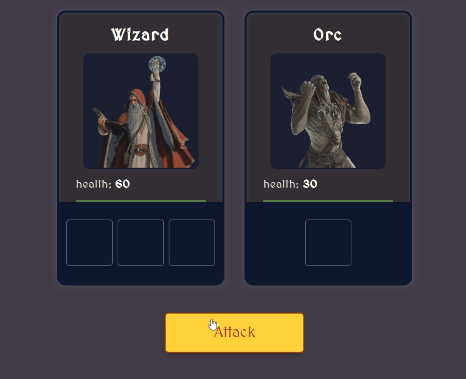

#wizard-vs monsters

A game app where there's four characters. one of them is the wizard, who fights three monsters. they all have the same attributes with different values and shares the same methods. So, a class was created to make instance of each character.

## test

## Authors

- [@Tarek Habash](https://github.com/tarek797)

